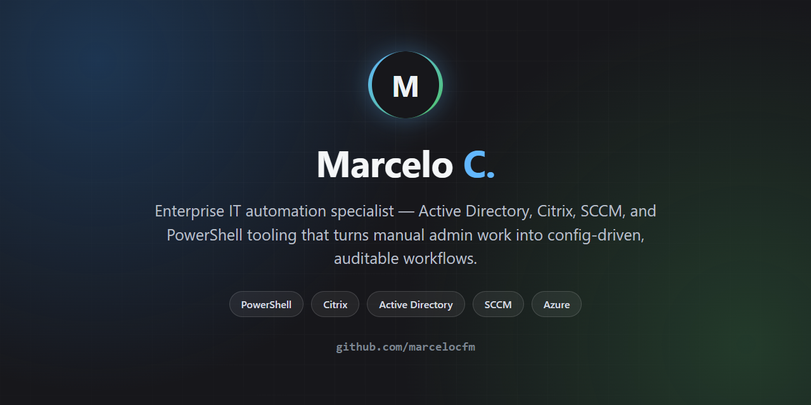

# Hi, I'm Marcelo 👋

Enterprise IT / Windows systems specialist — Active Directory, Citrix Virtual Apps and Desktops, SCCM, and infrastructure automation. I build tools that turn repetitive admin work (provisioning, decommissioning, health checks, ticket triage) into single-click, config-driven, auditable workflows.

## 🛠️ Stack

## 🚀 Featured projects

| Project | What it does |
|---|---|
| [**citrix-provisioning-assistant**](https://github.com/marcelocfm/citrix-provisioning-assistant) | End-to-end Citrix VAD machine provisioning — catalog/delivery group assignment, DR-aware hypervisor placement, tag management |
| [**enterprise-it-toolkit**](https://github.com/marcelocfm/enterprise-it-toolkit) | 7 standalone tools for enterprise Windows/Citrix/SCCM admin work: VM lifecycle, health checks, network diagnostics, AD inventory, and more |
| [**diagtool**](https://github.com/marcelocfm/diagtool) | Portable PowerShell diagnostics GUI for Service Desk teams — event log triage, SFC/CHKDSK, network test, one-click evidence export |

## 💡 How I build

- **Config-driven, not hardcoded** — environment details live in a config file, never in the script body, so a tool built for one environment works in the next without a rewrite.
- **Auditable by default** — anything that changes state logs what happened, who did it, and to what.
- **CI on every push** — PowerShell tools here run through [PSScriptAnalyzer](https://github.com/PowerShell/PSScriptAnalyzer) on every commit, not just eyeballed before a demo.

## 📊 GitHub stats

## 📫 Reach me

- GitHub: [@marcelocfm](https://github.com/marcelocfm)
- LinkedIn: [in/marcelocfm](https://www.linkedin.com/in/marcelocfm/)
