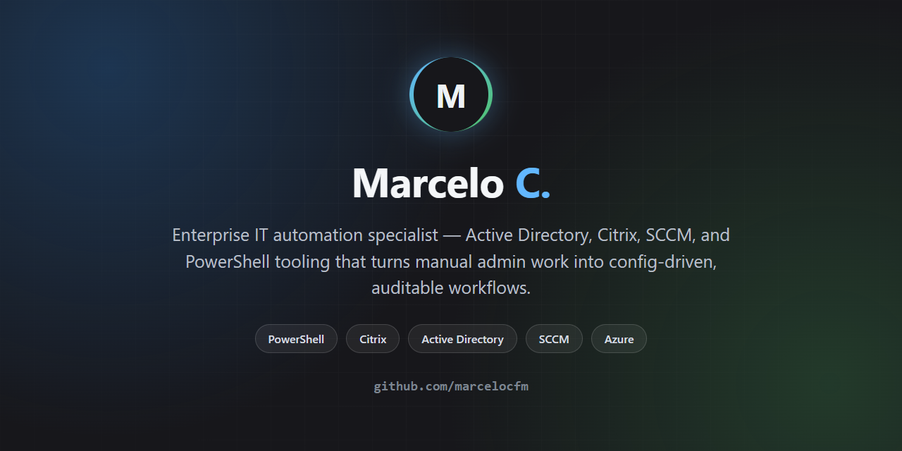

# Hi, I'm Marcelo

Enterprise IT and Windows systems specialist: Active Directory, Citrix Virtual Apps and Desktops, SCCM and infrastructure automation. I build tools that turn repetitive admin work (provisioning, decommissioning, health checks, ticket triage) into single-click workflows that read their settings from a config file and log every change they make.

## Stack

## How I build

- **Config-driven.** Server names, OUs and mail settings live in a config file, so a tool written for one environment moves to the next without a rewrite.
- **Auditable.** Anything that changes state logs what happened, who did it and to what.
- **No secrets in code.** Credentials are asked for at run time or kept as Windows-encrypted (DPAPI) strings, never written into scripts or config files.

## Contact

[LinkedIn: in/marcelocfm](https://www.linkedin.com/in/marcelocfm/)
